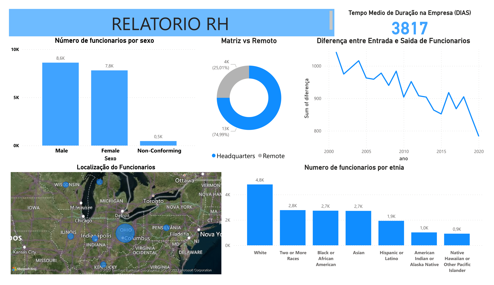

# Human Resources SQL/PowerBI Project

> Project using a dataset from the Human Resources department of a company, with more than 22,000 rows from the year 2000 to 2020 and with information about the employees.

### What i used
> **Data Cleaning** -> PostgreSQL  
**Importing the data** -> Python (I used python to Import the CSV into Postgre) 
**Data Visualization (Dashboards)** -> PowerBI

## Summary
> This project is an exploratory data analysis of a human resources dataset. The dataset was imported into PostgreSQL using Python, and then cleaned and explored using PostgreSQL. The data visualization was created using PowerBI.  
> The following were the main findings of the analysis:

> * There are more male employees.
> * The most common department is Engineering, followed by Accounting and Human Resources.
> * Most of the company is working on the headquartes of the company (Ohio).
> * The average length of employment for terminated employees is around 3817 days.
> * I created 5 age groups(18-24, 25-34, 35-44, 45-54, 55+). A large number of employees were between 25-34 followed by 35-44 while the smallest group was 55-64.

> This project was a great opportunity to learn how to use PostgreSQL and PowerBI for data analysis. I also learned how to import data into PostgreSQL using Python, which is a valuable skill for data scientists.

